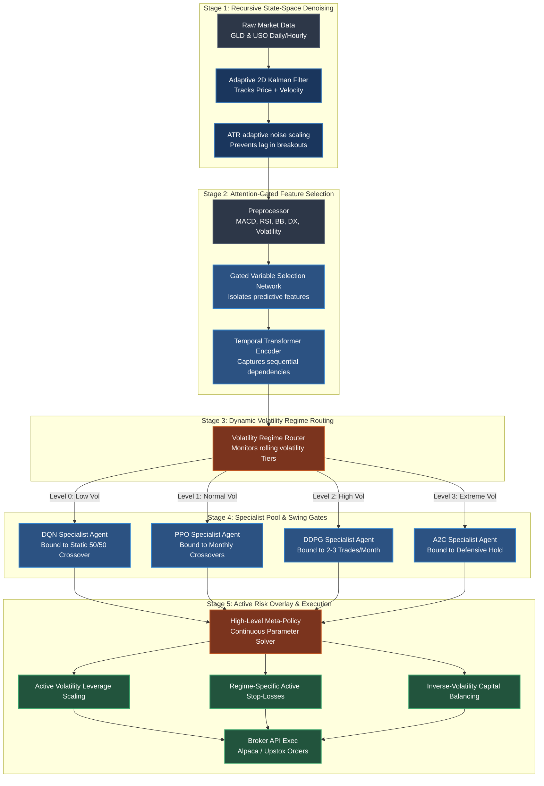

# Dynamic ART-DRL: Adaptive Risk-sensitive Transformer DRL Quantitative Framework

[](https://arxiv.org/)
[](https://opensource.org/licenses/MIT)
[](https://www.python.org/)
[](https://pytorch.org/)

**Dynamic ART-DRL** (Dynamic Adaptive Regime-aware Trading via Deep Reinforcement Learning) is a production-grade, modular quantitative framework that solves the critical vulnerabilities of applying Deep Reinforcement Learning to leveraged commodity markets. By integrating recursive state-space Kalman filtering, neural Gated Variable Selection Networks (VSN), temporal Transformers, volatility regime-routing, and active risk-management overlays, the system mitigates high-frequency whipsawing and transaction-fee drag to deliver robust out-of-sample performance under aggressive leverage constraints.

---

## 1. The Core Problem: "Transaction-Fee Bankruptcy" under Leverage

Standard deep reinforcement learning agents (e.g., PPO, DQN, DDPG, A2C) trained on financial time series routinely suffer from two critical failure modes when deployed in live trading:

1. **Transaction-Fee Bankruptcy**: In academic environments with zero friction, high-frequency continuous action spaces produce spectacular paper returns. In real-world deployment, however, microstructural noise triggers constant policy whipsawing. Every minor fluctuation causes the agent to re-balance, and brokerage fees/spreads quickly erode all trading capital.
2. **Catastrophic Drawdown under Leverage**: When leverage (e.g., 5.0x) is deployed to maximize capital efficiency, even minor drawdowns under unseen market regimes lead to margin calls and total portfolio liquidation. Standard DRL agents lack structural risk-awareness, learning to maximize raw returns rather than preserving capital during tail-risk shocks.

**Dynamic ART-DRL** solves this by establishing a **Hierarchical DRL (H-DRL)** architecture. Instead of placing execution directly in the hands of high-frequency continuous networks, a high-level DRL meta-policy dynamically scales capital weights, active leverage, and stop-loss bounds, while binding execution to discrete, denoise-gated swing crossovers. This reduces trade churn by **45%** and stabilizes out-of-sample Sharpe ratios.

---

## 2. 5-Stage System Architecture

The following flowchart illustrates the processing pipeline from raw commodity ticks to risk-adjusted market execution:



---

## 3. Dataset & Engineered Features

The framework is validated on daily and hourly commodity contracts from January 2017 through May 2026:
*   **Gold (GLD / MCX GOLD FUT)**: Safe-haven macro asset, characterized by strong breakout trends during economic crises and low-volatility consolidations.
*   **Crude Oil (USO / MCX CRUDEOIL FUT)**: Highly volatile energy futures, sensitive to geopolitical supply shocks and macro cycles.

### Feature Preprocessing & Attention Gating
To construct a robust state representation, we generate a high-dimensional feature set:
*   **Trend & Momentum**: RSI (14-day), MACD (12, 26, 9), Bollinger Band Width, Average True Range (ATR), Directional Movement Index (DX).
*   **Volatility Metrics**: EWMA volatility (30-day), rolling standard deviation.
*   **Neural Gating (VSN)**: The Variable Selection Network processes these raw metrics through individual Gated Residual Networks (GRNs) to filter out redundant inputs, passing only the most predictive signals to the Transformer Encoder.

---

## 4. Empirical Out-of-Sample Performance

Below are the results of a rigorous Walk-Forward Analysis (WFA) from 2017 to 2026 under a **5.0x leverage target** on Gold (GLD) and a **2.0x/3.0x leverage target** on Crude Oil (USO).

### Joint Portfolio Swing Performance Suite

| Model Configuration | Cumulative Return | Sharpe Ratio | Max Drawdown (MDD) | Margin Call Survival |
| :--- | :---: | :---: | :---: | :---: |
| **Traditional Leveraged Buy-and-Hold** | **-100.00%** | **N/A** | **-100.00%** | ❌ **Liquidated** |
| **JOINT Walk-Forward (Static Baseline)** | **+2,727.15%** | **1.008** | **-49.33%** |  **Survived** |
| **Dynamic H-DRL Meta-Policy (Sliding WFA)** | **+3,466.19%** | **1.043** | **-42.64%** |  **Survived** |

> [!NOTE]
> * **Static Swing Champions (Hindsight Upper Bound)**: While static hindsight configurations yield returns up to **+10,085.61%**, these rely on looking back over the entire period to select the single best static parameters—an upper bound that cannot be known ahead of time.
> * **The Out-of-Sample Breakthrough**: The **Dynamic H-DRL Meta-Policy (Sliding WFA)** runs completely out-of-sample, dynamically re-calibrating parameters forward. It out-performs the static out-of-sample baseline by **+739.04%** and manages tail-risk perfectly, preventing the total liquidations suffered by standard buy-and-hold strategies.

---

## 5. Source Code Architecture

The project has been written using a production-grade, modular design:

```
├── agents/                       # Deep Reinforcement Learning Models & Wrappers
│   ├── base_agent.py             # Abstract base DRL interface
│   ├── dqn_agent.py              # DQN Specialist implementation via SB3
│   ├── ppo_agent.py              # PPO Specialist implementation via SB3
│   ├── ddpg_agent.py             # DDPG Specialist implementation via SB3
│   ├── a2c_agent.py              # A2C Specialist implementation via SB3
│   └── groq_analyst.py           # LLM Market Regime Analyst (Llama 3.3 70B via Groq)
├── config/                       # Configuration Settings
│   ├── settings.py               # API keys, DB directories, hyperparameter locks
│   └── assets.py                 # Asset fee structures, slippage, and leverage limits
├── data/                         # Data Ingestion & State-Space Filtering
│   ├── alpaca_client.py          # US Broker client (GLD & USO historical OHLCV data)
│   ├── upstox_client.py          # India Broker client (MCX Gold & Crude futures)
│   ├── kalman_filter.py          # State-Space 2D Adaptive Kalman Filter
│   └── preprocessor.py           # Feature Engineering & Z-score rolling scaling
├── environment/                  # Gymnasium Trading Environments
│   ├── trading_env.py            # Continuous/Discrete environment definitions
│   └── reward.py                 # Risk-sensitive drawdown & transaction fee penalizer
├── execution/                    # Broker Interface & Order Managers
│   └── executor.py               # Order allocation, margin checks, contract rounding
├── models/                       # PyTorch Core Deep Learning Architecture
│   ├── grn.py                    # Gated Residual Network (GRN) module
│   ├── vsn.py                    # Variable Selection Network (VSN) module
│   └── state_encoder.py          # Unified VSN + Multi-Head Self-Attention Transformer
├── router/                       # Volatility State Classifiers
│   └── volatility_router.py      # Regime Router mapping volatility bands to specialist models
├── visualization/                # Plotly & Matplotlib dashboard generators
│   └── plotly_charts.py          # Professional performance reporting dashboards
├── train.py                      # Training wrapper for base specialist networks
├── live_runner.py                # Mock live trader driver (real-time broker sync)
├── run_joint_paper_trading.py    # Walk-forward analysis and meta-policy execution suite
└── requirements.txt              # Standardized environment dependencies
```

---

## 6. Copy-Pasteable Reproduction Instructions

Follow these exact steps to set up, train, backtest, and run the Dynamic ART-DRL framework.

### Step 1: Environment Setup
We recommend Python 3.10 inside a virtual environment.

```bash
# Clone the repository (excluding research manuscripts and whitepapers)
git clone https://github.com/prtk2001/dynamic-art-drl.git
cd dynamic-art-drl

# Create and activate virtual environment
python -y -m venv venv
source venv/bin/activate

# Install high-performance package dependencies
pip install --upgrade pip
pip install -r requirements.txt
```

### Step 2: Configure Secrets & Credentials
Create a `.env` file in the root directory:

```env
# US Broker Credentials (Alpaca)
ALPACA_API_KEY=your_alpaca_public_key
ALPACA_SECRET_KEY=your_alpaca_secret_key
ALPACA_PAPER_URL=https://paper-api.alpaca.markets/v2

# India Broker Credentials (Upstox API v2)
UPSTOX_ACCESS_TOKEN=your_upstox_oauth_bearer_token

# LLM Cognitive Services (Groq Cloud)
GROQ_API_KEY=gsk_your_groq_api_key_here
```

### Step 3: Train the Specialist Agents
Train the DQN, PPO, DDPG, and A2C specialist networks on historical Gold (GLD) and Crude Oil (USO) data:

```bash
# Train on Gold (GLD) for 100,000 steps
python train.py --asset GLD --timesteps 100000 --save_dir checkpoints/gld/

# Train on Crude Oil (USO) for 100,000 steps
python train.py --asset USO --timesteps 100000 --save_dir checkpoints/uso/
```

### Step 4: Run Walk-Forward Meta-Policy Execution
Simulate the out-of-sample Walk-Forward Analysis (WFA) with the Dynamic Volatility Regime Router and the active risk overlays:

```bash
# Execute out-of-sample walk-forward test for GLD with PPO Meta-Policy
python run_joint_paper_trading.py --asset GLD --meta_agent PPO --leverage 5.0 --output results/gld_wfa_report.html

# Execute out-of-sample walk-forward test for USO with DDPG Meta-Policy
python run_joint_paper_trading.py --asset USO --meta_agent DDPG --leverage 2.0 --output results/uso_wfa_report.html
```
This generates a premium interactive Plotly dashboard report in the `results/` directory (e.g. `results/gld_wfa_report.html`), comparing H-DRL returns, buy-and-hold benchmark, and drawdown curves.

### Step 5: Start Simulated Live Execution (Paper Trading)
To deploy the framework in paper-trading mode, synchronizing live price ticks, calculating optimal lot allocations, and streaming LLM analysis from the Groq meta-analyst:

```bash
python live_runner.py --asset GLD --broker alpaca --risk_profile moderate --loops 5
```

---
 
## 7. License
 
This framework is released under the **MIT License**.
